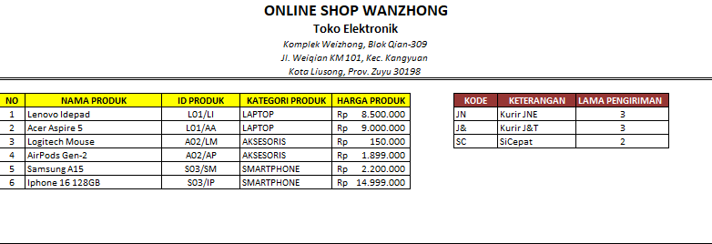
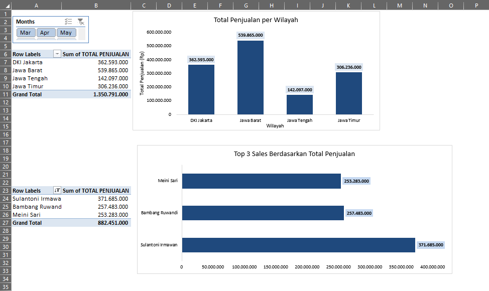

# Electronic Online Shop Management & Sales Analytics (Excel Portfolio)

## 📌 Project Overview
This repository contains an end-to-end Excel data project for a mock e-commerce retail store named **"Online Shop Wanzhong"**. The project spans from building an automated transaction processing architecture using advanced lookup formulas to creating a business intelligence dashboard that tracks regional sales and representative performance.

## 🗂️ Data Architecture & Master Tables
The system utilizes a centralized master data structure to ensure absolute data integrity across thousands of flight logs. The automation relies heavily on two primary reference tables:
*   **Product Master Table:** Contains granular mappings of *Product ID (ID Produk)*, *Product Name (Nama Produk)*, *Category (Kategori Produk)*, and *Unit Price (Harga Produk)* across Laptops, Accessories, and Smartphones.
*   **Logistics Reference Table:** Maps shipping prefixes (e.g., `JN`, `J&T`, `SC`) directly to their respective *Courier Names (Keterangan)* and *Estimated Delivery Lead Times (Lama Pengiriman)*.

## 🛠️ Excel Formulas & Techniques Demonstrated
Advanced lookup and conditional logic were implemented to fully automate the core transaction dataset:
*   **Dynamic Parsing (`VLOOKUP` + `MID`):** Combines text manipulation with standard lookups to automatically extract *Product Category*, *Courier Services*, and *Delivery Time* directly from custom-coded transaction strings.
*   **Flexible Item Retrieval (`INDEX` + `MATCH`):** Deployed a robust multi-column lookup method instead of rigid lookup alternatives to seamlessly fetch exact *Product Names* from the master tables.
*   **Complex Conditional Logic (Nested `IF` Statements):** Engineered nested conditions to automate business rules, including dynamic *Discount Percentages* based on sales tiers, billing classifications for *Payment Types* (e.g., COD vs Non-COD), and *Regional Sorting (Wilayah)* based on delivery targets.

## 📊 Business Intelligence Dashboard (Pivot Tables & Charts)
An interactive executive dashboard was constructed using **Pivot Tables**, **Pivot Charts**, and **Timeline Slicers** to monitor key sales metrics across March, April, and May:
*   **Regional Performance Analytics:** Features a multi-level Pivot Table paired with a vertical **Column Chart** to analyze the *Total Sales per Region (Total Penjualan per Wilayah)*, highlighting Jawa Barat as the top revenue contributor.
*   **Salesperson Performance Tracking:** Implemented a targeted filter and a horizontal **Bar Chart** to isolate and rank the **Top 3 Sales Representatives** based on their total cumulative revenue generated.
*   **Interactive Time Slicing:** Included an active monthly **Slicer (Mar / Apr / May)** allowing stakeholders to filter all dashboard visuals simultaneously for deep-dive period analysis.

## 🖼️ Project Visual Previews
*Below are the visual snapshots of the implemented system components:*

### 1. Centralized Master Data

### 2. Interactive Analytics Dashboard

## 📁 Repository Structure
*   `Electronic_Online_Shop_Management.xlsx` - The core automated Excel workbook.
*   `README.md` - Documentation of the project.

## 🚀 How to Use This Project
1. Clone or download this repository.
2. Open the `.xlsx` workbook using Microsoft Excel (2019 or newer recommended).
3. Test the interactive **Monthly Slicers** on the dashboard tab to witness real-time reporting updates.

## 💬 Let's Connect! I am actively seeking Data Analyst opportunities where I can bridge the gap between complex data pipelines and corporate strategy.

LinkedIn: https://linkedin.com/in/aulia-khairunnisa
Email: aulkhairn@gmail.com
